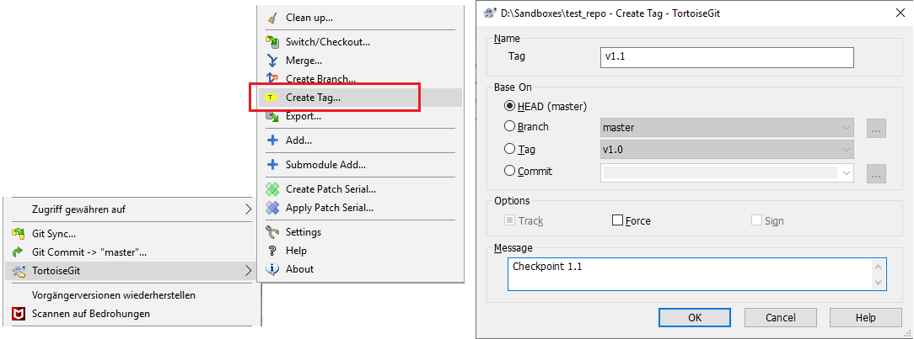
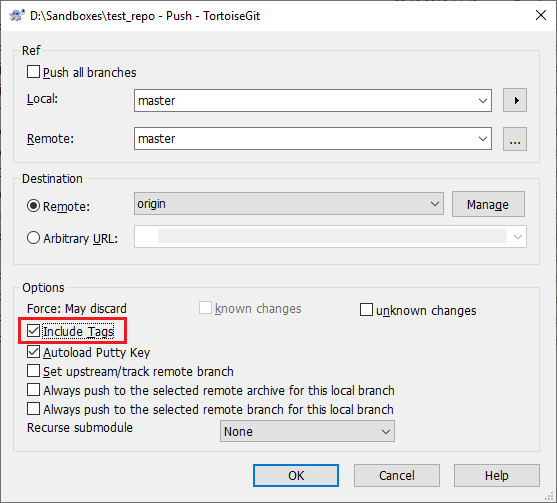
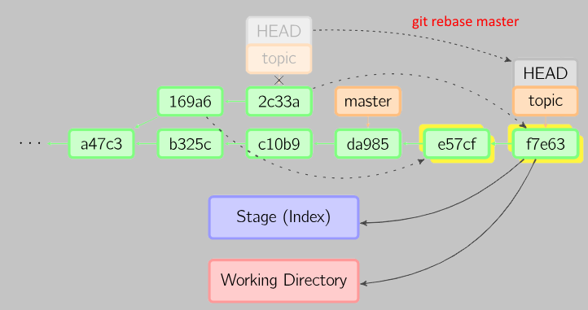
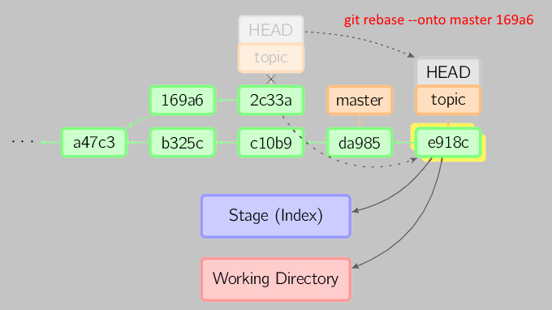

[Back](../)

&nbsp;

# Git basics

&nbsp;

`Basic Repository Concepts`  

  

The illustration on the left shows a typical structure of a ``Centralised Version Management`` system, like e.g. CVS, MKS or subversion.  
Every developer has a *Working Directory* on his machine with all project files. After editing them locally, he ``commits`` his changes to the central server or ``updates`` his Workspace with the changes from the server. The current and historic versions of the files (*`Repository`*), the parallel development lines (*``Branches``*) and the versioning (*``Tags``*) are all done centrally on the server.  

&nbsp;

At a ``Decentralized Version Management`` system, like e.g. Git, there is no separation between developer and server environment. Every developer has his own workspace with the files he is working on, but also his own local repository (called *`Clone`*) with all Versions, Branches and Tags. Changes are also done by ``Commit``-ing them, but first only in the local repository. The other developers don't see this new versions right away, `Push` and `Pull` commands transfer the changes from the one repository to the next. Technically all repositories in a decentralized repository are equivalent, theoretically you would not need a server: You could exchange all changes between the developer machines. For comfort reasons oftentimes a shared central repository, like e.g. GitHub, is used.  

&nbsp;

`Repository structure`  

  

Your local repository consists of three 'instances', that are managed by Git.  
The first one is your **Working directory** (or "*Arbeitskopie*"), which consists of  the real files.  
The second one is the **Index** which acts as an intermediate state and the last one is the **HEAD** which points to your last commit.

&nbsp;

**add & commit**  
You can propose changes (add to *Index*) with  
```git
>> git add <file_name>             // adds file 'file_name' to Index
>> git add *                       // adds all changed files in folder (and subfolder) to Index
```
That was the first step in the git workflow, you acknowledge the changes with  
```git
>> git commit -m "commit_message"
```
Now all changes have moved to the *HEAD*, but they are not yet in the remote repository.

&nbsp;

**upload changes**  
The changes are now in the *HEAD* of your local repository.  
To send the changes to your remote repository, execute  
```git
>> git push origin master
```
You can replace *origin* and *master* with every other combination of remote and branch.

&nbsp;

**update & merge**  
To update your local repository with the newest changes from the remote, use  
```git
>> git pull origin master
```
in your *working directory*, to first download the changes (**fetch**) and then merge with your local files your *working directory* (**merge**).  
Again, you can replace *origin* and *master* with every other combination of remote and branch.  

Git is trying to merge the changes automatically. Unfortunately, this is not always possible and often ends in conflicts.  
<u>You are responsible to solve those conflicts by manually editing the respective files</u> (e.g. 'TortoiseGit' -> 'EditConflicts').  

When you are finished with conflice solving, you have to tell that to Git with the following command:  
```git
>> git add <file_name>
```
Before you merge the changes you can view the differences with
```git
>> git diff <source_branch> <target_branch>
```

&nbsp;

**undo changes**  
You can undo changes to files in your local *working directory* with  
```git
>> git checkout -- <file_name>
```
to the last change of the HEAD. Changes that are already added to *Index*, remain there.  

If you want to completely overwrite your local changes with the contents from remote, you can do this with  
```git
>> git fetch origin
>> git reset -- hard origin/master
```
(!) Attention: This will completely overwrite all files in your working directory <u>and</u> also delete all files which are not part of the repository.

&nbsp;

***

## Tags and Releases  

Like most VCSs, Git has the ability to tag specific points in a repository’s history as being important.  
Typically, people use this functionality to mark release points (v1.0, v2.0 and so on).
&nbsp;

**What's the difference between a Tag and a Release?**

A ``Tag`` is a pointer to a specific commit. This pointer can be super charged with some additional information (identity of the creator of the tag, a description, a GPG signature, ...).  

&nbsp;&nbsp;&nbsp;&nbsp;&nbsp;&nbsp;&nbsp;&nbsp;&rarr; &nbsp; <span style="color:Green">A <u>Tag is a git concept</u> whereas a <u>Release is a higher level GitHub concept</u></span>.

A ``Release`` is created from an existing ``Tag`` and exposes release notes and links to download the software or source code from GitHub.

&nbsp;

The following steps are all done locally in your Sandbox.

**Listing your tags**  
Listing the existing tags in Git is straightforward.
- In **Git BASH**  
  ````c
  git tag
  ````  
&nbsp;

**Creating Tags**  
Creating an annotated tag in Git is simple. The easiest way is to specify **-a** when you run the tag command.  
The **-m** specifies a tagging message, which is stored with the tag.  
- In **Git BASH**  
  ````c
  git tag -a v1.4 -m "my version 1.4"
  ````

- In **TortoiseGit**  
  In the *TortoiseGit* submenu select `Create Tag... `. In the dialogue enter your 'Tag' (usually a version number) in the upper box and write a short description of the Tag in the lower box.  
  &nbsp;  
     
  &nbsp;  
  Afterwards you click on `Ok` and you are done.

&nbsp;  


**Pushing Tags**

Tags are not pushed automatically to your GitHub repository with a Push to remote.  
To push your locally created Tags you can fo the following  
- In **Git BASH**
  ````
  git push <remote> --tags
  ````  
- In **TortoiseGit**  
  In the *TortoiseGit* submenu select `Push... `.   
  In the dialogue (see below) select ``Include Tags`` before pushing your changes to remote.  
  &nbsp;  
     
  &nbsp;  
  Afterwards click on `Ok` and your tags are available on your remote.

&nbsp;

***

## Branches  
Nearly every VCS has some form of branching support. Branching means you diverge from the main line of development and continue to do work without messing with that main line. The way Git branches is incredibly lightweight, making branching operations nearly instantaneous, and switching back and forth between branches generally just as fast.

Common Branch commands

- In **Git BASH**

  **List all existing branches**  
  The ``git branch`` command is used to list all existing branches in a repository.
  An asterisk will appear next to the currently active branch.
  ````
  >> git branch
      * master
  ````  

  **Create new branch**  
  To create a new branch, you can use the ``git branch <new_branch>`` command. This will create a new branch mirroring the commits on the currently active branch.  
  ````
  >> git branch new-branch
  >> git branch
     * master
     new_branch
  ````    

  **Change the active branch**  
  To start working on the new branch we first need to run the command git checkout new-branch. This will change the active branch to the new branch.  
  ````
  >> git checkout new-branch
     Switched to branch ‘new-branch'
  >> git branch
     master
     * new-branch
  ````
  At this point, commits can be made on the new branch to implement the new feature.  

  **Merge changes back to master branch**  
  Once the feature is complete, the branch can be merged back into the main code branch (usually master).  
  First we run ``git checkout master`` to change the active branch back to master.  
  Then we run the command ``git merge new-branch`` to merge the new feature into the master branch.

  Note that ``git merge`` merges the specified branch into the currently active branch.  
  So we need to be on the branch that we are merging into.  
  ````
  >> git checkout master  
     Switched to branch 'master'
  >> git merge new-branch
  ````
  The new feature commits now appear in the master branch.

&nbsp;

***

&nbsp;

# Explanation of Terms

### _Fork_ &nbsp; <font size="-1">- Best Use -</font>

If you are not registered as an collaborator for a specific project, pushing back to an existing branch
or branching is usually not possible. One possibility at this point is to fork the project.

Forking is nothing more than <ins>creating a clone of the project on the GitHub server side</ins>:
* without the possibility to directly push back
* with _fork queue_ feature added to manage the merge request

You keep a fork in sync with the original project by:
* adding the origin project as a remote ("upstream")
* fetching regularly from that original project
* rebase your current development on top of the branch of interest you just updated from

>The rebase allows you to make sure your changes are straightforward (no merge conflicts to handle),
>making your _pull requests_ that more easy when you want the maintainer of the original project to
>include your patches in his project.

The goal is really to allow collaborations even though direct participation is not always possible.

&nbsp;

With a fork, the merge experience has an extern level of indirection (push first on the fork, then
ask for a pull request) with the risk of changes in the meantime on the original repository, making your
fast-forward merges not that fast-forward anymore.

To avoid this problem, the correct workflow is to
```git
>> git pull --rebase upstream
```
(rebase your work on top of new commits from upstream) and then
```git
>> git push --force origin
```
in order to rewrite the history in such a way that your own _Commits_ are always on top of the
_Commits_ from the original (_upstream_) repository. Final move is a 'Pull Request' to the original
repo.

&nbsp;

***

### _Rebase_

To _Rebase_ is an alternative to a _Merge_ of two branches. While a _Merge_ creates a new _Commit_ with two
parents and leaves a non-linear _Commit_ history, a _Rebase_ puts all _Commits_ of the current _Branch_ to the
end of the current _Main Branch_. This leads to a linearization of the _Commit_ history.

In a way it's an automated way to execute multiple _cherry-picking_ commands one after the other.

<br>

<br><br>

```git
>> git rebase master
```

The command above takes all _Commits_ of the Branch 'topic' which do not exist in the Branch 'master' (169a6 and 2c33a)
and attaches them to the Branch 'master'. Afterwards the Branch and the HEAD are shifted to the last appended _Commit_.
Be aware that after that nothing is pointing to the old _Commits_ anymore, so they are, where necessary, deleted by the
_Garbage Collector_.

The option _--onto_ allows you to select how far the Rebase is supposed to go back for the _Commits_ to append. The following
command appends all _Commits_ of Branch 'topic' after _Commit_ 169a6 to the Branch 'master', in this case only the _Commit_ 2c33a.

```git
>> git rebase --onto master 169a6
```

<br>

<br><br>

&nbsp;

## To be continued...

&nbsp;

&nbsp;

[Back](../)
