[Back](../)

&nbsp;

The following step-by-step instructions show both, `Git Bash` and `TortoiseGit` ways of solving the task.  

## Commit...

[... your working directory changes to your local repository.](#link006)  

[... your working directory changes to your local repository and Push it to a remote.](#link007)  

[... a single local file to your local repository and Push it to a remote.](#link013)

## Update...

[... your fork with the contents of the main repository.](#link000)  

[... the main repository with the contents of your fork.](#link001)  

[... your local project with the contents of a remote repository.](#link002)  

[... your local project with the contents of a remote repository brute force.](#link003)  

[... a single local file with the corresponding file on the remote server.](#link004)  

[... your local project with the most recent *CM_Template* content.](#link005)  

[... the password for accessing GitHub server ("fatal: Authentication failed" - Error ).](#link012)

## Undo...

[... a Commit <u>or</u> 'Going back to an old project state'.](#link016)

[... changes made to files in your Working Directory.](#link008)

[... the last commit in your Working Directory to your Local Repository.](#link009)  

[... a former push to remote (or 'Overwrite a remote hard with the current local contents').](#link010)  

[... a former file deletion (or 'Retrieve a file that was deleted in a former Commit').](#link017)  

## Remove...

[... a single local file from the staging area ('Un-add' a file).](#link014)  

[... a single file from your repository (locally and on GitHub).](#link015)  

## Check...

[... commit history to view file content differences.](#link011)  

&nbsp;

&nbsp;

&nbsp;

&nbsp;

***  

## Naming Convention  

 - `Working Directory` :  
    The local folder (which usually comes with the 'Git Clone') with the files you are actively working on (aka your `Sandbox`).

 - `Local Repository` :  
    The local repository (which usually comes with the 'Git Clone'). Is located in a hidden folder `.git` in your 'Working Directory'.

 - `Local Project` :  
    Refers to both, the 'Working Directory' and the 'Local Repository'.

 - `Main Repository` :  
    The master remote repository (for <u>HiL Application</u>: all project subdirectories under 'VED-CarMaker-HIL') on GitHub.

 - `Remote Repository` aka `Remote` :  
    Can be either the same as your 'Main Repository' or the 'Fork' repository which was previously forked from the 'Main Repository' on GitHub.

 - `Fork` :  
    The remote repository which was previously forked from the 'Main Repository'. Forking is nothing more than creating a clone of the 'Main Repository' on the GitHub server side.

&nbsp;

***

## [&rarr; &nbsp; Frequently used commands](#freqBash)  

***

&nbsp;

&nbsp;

&nbsp;

&nbsp;


***

# Commit...

### <a name="link006"></a> ... your working directory changes to your local repository.    

&nbsp;

- In **Git BASH**  

  1. Add your changes to `Index` (or *Stage*)  
      ```git
      >> git add .                // adds all changed files in folder (and subfolder) to Index
      or
      >> git add <file_name>      // adds file 'file_name' to Index
      ```  

  2. Acknowledge your changes with
    ```git
    >> git commit -m "commit_message"
    ```
    Now all your changes have moved to your local repository (the `HEAD`).

&nbsp;

- In **TortoiseGit**  

  1. In the *TortoiseGit* submenu select `Git Commit -> "master"... `. In the dialogue enter your commit message in the upper box and select the file(s) you want to commit (they appear under `Not Versioned Files`) in the lower box. The selection of a file is the equivalent to the `git add` command in the Bash.  
  &nbsp;  
     
  &nbsp;  
  Afterwards you click on `Commit` and you are done.
  &nbsp;

&nbsp;
<table>
  <thead>
    <tr>
      <th style="text-align: left"><a href="#top">&larr; Back to Top</a></th>
    </tr>
  </thead>
</table>

&nbsp;

### <a name="link007"></a> ... your working directory changes to your local repository and Push it to a remote.   

&nbsp;

- In **Git BASH**  

  1. Add your changes to `Index` (or *Stage*)  
      ```git
      >> git add .                // adds all changed files in folder (and subfolder) to Index
      or
      >> git add <file_name>      // adds file 'file_name' to Index
      ```  

  2. Acknowledge your changes with
    ```git
    >> git commit -m "commit_message"
    ```
    Now all your changes have moved to your local repository (the `HEAD`).  

  3. The changes are now in the `HEAD` of your local repository. To send the changes to your remote repository, execute  
    ```git
    >> git push origin master
    ```
    With `origin` and `master` being your *remote* and *branch*.

  &nbsp;

- In **TortoiseGit**  

  1. In the *TortoiseGit* submenu select `Git Commit -> "master"... `. In the dialogue enter your commit message in the upper box and select the file(s) you want to commit (in case of new files, they appear under `Not Versioned Files`) in the lower box. The selection of a file is the equivalent to the `git add` command in the Bash.  
  &nbsp;  
  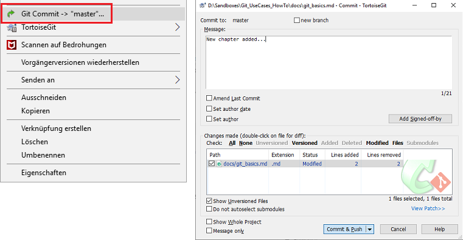   
  &nbsp;  
  Afterwards you click on `Commit & Push` and you are done.
  &nbsp;

&nbsp;
<table>
  <thead>
    <tr>
      <th style="text-align: left"><a href="#top">&larr; Back to Top</a></th>
    </tr>
  </thead>
</table>

&nbsp;

### <a name="link013"></a> ... a single local file to your local repository and Push it to a remote.   

&nbsp;

- In **Git BASH**  

  1. Enter the 'Commit' command with the file name you want to commit
    ```git
    >> git commit -m "commit_message" path/to/file_to_commit
    ```
    Now the changes for *file_to_commit* have moved to your local repository (the `HEAD`).  

  2. The changes are now in the `HEAD` of your local repository. To send the changes to your remote repository, execute  
    ```git
    >> git push origin master
    ```
    With `origin` and `master` being your *remote* and *branch*.

&nbsp;

- In **TortoiseGit**  

  1. In the *TortoiseGit* submenu select `Git Commit -> "master"... `. In the dialogue enter your commit message in the upper box and select the single file you want to commit (in case of a new file, it appears under `Not Versioned Files`) in the lower box. The selection of a file is the equivalent to the `git add` command in the Bash.  
  &nbsp;  
     
  &nbsp;  
  Afterwards you click on `Commit & Push` and you are done.
  &nbsp;


&nbsp;
<table>
  <thead>
    <tr>
      <th style="text-align: left"><a href="#top">&larr; Back to Top</a></th>
    </tr>
  </thead>
</table>

&nbsp;

***

# Update...
&nbsp;  

### <a name="link000"></a> ... your fork with the contents of the main repository.

Two possibilities for the update process are shown. The first possibility is done completely in GitHub.  
&nbsp;

**Possibility #1**  
This solution is completely done in the browser in GitHub.  

1. Open <span style="color:Green">github.conti.de</span> in a Browser and navigate to your fork.
2. Click the <span style="color:Green">Compare</span> button on the right, below the <span style="color:Green">Clone or Download</span> button.  
&nbsp;  
  
&nbsp;  
3. Now you select as target repository (== *base repository*) your fork (the name usually contains your WinID).  
&nbsp;  
  
&nbsp;  
After you selected your fork, the message <span style="color:Green">"There isn't anything to compare"</span> will appear.  
&nbsp;  
4. For being able to select a different *head repository*, click on <span style="color:Green">compare across forks</span>.  
&nbsp;  
  
Now you can set the *head repository* on the right to the main repository.  
&nbsp;  
  
&nbsp;  
5. As a last step you create a <span style="color:Green">Pull Request</span> for your own repository as target repository. &nbsp;&nbsp; 

&nbsp;

**Possibility #2 (better)**  
This solution is done in your local environment.  
Basically you are pulling all changes from the remote main repository to your local repository and push it to the fork afterwards.  
Prerequisite is that the main repository (usually called '*upstream*') is set as a remote in your local environment.

- In **Git BASH**  

  1. Fetch the desired branch (here: `master`) of your remote (here: `upstream`)
      ```git
      >> git fetch upstream master
      ```
      When you run `git fetch upstream master`, it will fetch all commits from your remote master and put it onto `upstream/master` (on your local machine).

  2. Integrate the changes from remote to your local ones. Resolve possible merge conflicts by hand.  
      ```git
      >> git rebase -i upstream/master
      or
      >> git merge upstream/master
      ```
      `git rebase -i upstream/master` is the favorable option compared to `git merge upstream/master` because it keeps your commit history clean. If you run `git rebase -i upstream/master`, the following happens:  
      - all your commits that were not on `upstream/master` are temporarily put away
      - your (local) `master` is updated with whatever is on `upstream/master`
      - your commits are replayed on top of your updated (local) `master`  
      &nbsp;
  3. Finally push your local changes to your fork repository and you are done.  
  If you've rebased your branch onto `upstream/master` you may need to force the push in order to push it to your forked repository on GitHub. You'd do that with:  
      ```git
      >> git push -f origin master
      ```  

  `Attention!` The steps 1. and 2. can also be done in one step by simply doing
  ```git
  >> git pull --rebase upstream master
  ```  
  &nbsp;
  This is the recommended way of updating the fork update, because it does not lead to a messy commit history.

&nbsp;

- In **TortoiseGit**  

  1. Fetch the desired branch (here: `master`) of your remote (here: `upstream`)  
       
    &nbsp;
  2. Integrate the changes from remote to your local ones by `Rebase`. Resolve possible merge conflicts by hand.  
       
    Here you would first select the ''*Upstream:*'' for which you did the *Fetch* in the first step (here: `remotes/upstream/master`) and then select the latest *Commit* in the Commit list (topmost entry). Afterwards click `Start Rebase`.      
    &nbsp;
  3. Finally push your local changes to your fork repository and you are done.  
    

&nbsp;
<table>
  <thead>
    <tr>
      <th style="text-align: left"><a href="#top">&larr; Back to Top</a></th>
    </tr>
  </thead>
</table>

&nbsp;

### <a name="link001"></a> ... the main repository with the contents of your fork.

  &nbsp;&nbsp;&nbsp;&nbsp;&nbsp;&nbsp;This step is done in the browser in GitHub which provides the suitable functionality.

- In **GitHub**  

  1. Navigate to your fork on your personal GitHub account.  
  2. To move the contents of our fork to the main repository, you have to make a so called `Pull Request`.  
     For that click on .
  3. In the following dialogue, set a title for your Pull Request and specify your newly implemented changes a little closer in the box below.
     If configured, choose a reviewer for the task of finally Merging the Pull Request.  
     Click `Create Pull Request` to demand the review.  
     &nbsp;
       
     &nbsp;
  4. In case you are the one who has the required rights to perform the Merge, you can directly Merge your changes to the main repository.
     If you don't have the rights or you have selected a reviewer, the person who is in charge now is notified by mail and will Merge your changes (or not in case of problems).


&nbsp;
<table>
 <thead>
   <tr>
     <th style="text-align: left"><a href="#top">&larr; Back to Top</a></th>
   </tr>
 </thead>
</table>

&nbsp;

### <a name="link002"></a> ... your local project with the contents of a remote repository.

&nbsp;&nbsp;&nbsp;&nbsp;&nbsp;&nbsp;&nbsp;This update requires you to have registered the remote repositories to the Git environment of your project.

- In **Git BASH**      

  1. To update your project with the content of a remote repository, you simply use the `Pull` command:
  ```git
  >> git pull --rebase upstream master
  ```
  This is equivalent to  
  ```git
  >> git fetch upstream master
  >> git rebase -i upstream/master
  ```  
  Alternatively you can merge   
  ```git
  >> git pull upstream master
  or
  >> git fetch upstream master
  >> git merge FETCH_HEAD
  ```
&nbsp;

- In **TortoiseGit**  

  ``Rebase``

  1. Fetch the desired branch (here: `master`) of your remote (here: `upstream`)  
       
    &nbsp;
  2. Integrate the changes from remote to your local ones by `Rebase`. Resolve possible merge conflicts by hand.  
       
    Here you would first select the ''*Upstream:*'' for which you did the *Fetch* in the first step (here: `remotes/upstream/master`) and then select the latest *Commit* in the Commit list (topmost entry). Afterwards click `Start Rebase`.  

  or  

  ``Merge``  

  1.  Select `Merge...` in the TortoiseGit submenu and the branch from which you want to pull from.
    &nbsp;  
    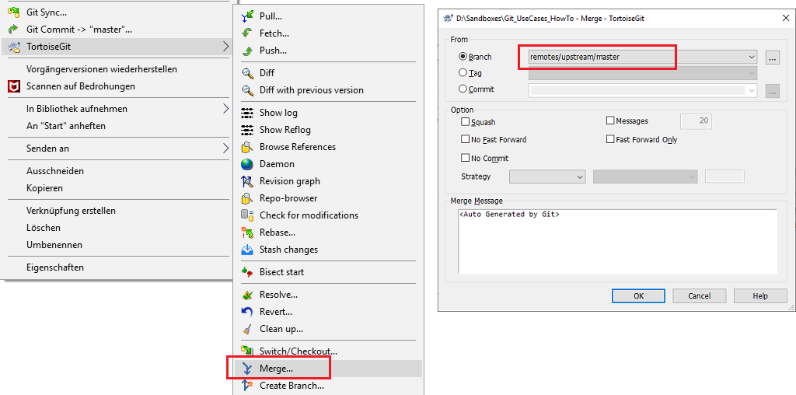    

&nbsp;
<table>
  <thead>
    <tr>
      <th style="text-align: left"><a href="#top">&larr; Back to Top</a></th>
    </tr>
  </thead>
</table>

&nbsp;

### <a name="link003"></a> ... your local project with the contents of a remote repository brute force.

&nbsp;

- In **Git BASH**  
  1. Fetch the desired branch (here: ``master``) of your remote (here: ``upstream``)
    ```git
    >> git fetch upstream master
    ```  
  2. Overwrite your local *Working Directory* changes with the contents from remote  
    ```git
    >> git reset --hard upstream/master
    ```
    (!) Attention: This will completely overwrite all files in your working directory <u>and</u> also delete all files which are not part of the repository.

&nbsp;

- In **TortoiseGit**  

  1. Fetch the desired branch (here: `master`) of your remote (here: `upstream`).  
       
    &nbsp;
  2. Select `Switch/Checkout` in the TortoiseGit submenu.  
       
    &nbsp;  
    For the *Branch*, select your remote beginning with 'remotes/' (here `upstream/master`).  
    `Create New Branch` should be checked and have the name of your current local branch you want to overwrite.  
    Check also `Overwrite working tree changes (force)` and `Override branch if exists` and click 'OK'.  

&nbsp;
<table>
  <thead>
    <tr>
      <th style="text-align: left"><a href="#top">&larr; Back to Top</a></th>
    </tr>
  </thead>
</table>

&nbsp;

### <a name="link004"></a> ... a single local file with content from the remote server.

&nbsp;

- In **Git BASH**  
  1. Fetch the desired branch (here: ``master``) of your remote (here: ``upstream``) containing the file you want to update.
    ```git
    >> git fetch upstream master
    ```  
  2. Update of the desired *file* `path/to/file` in subfolder *path/to/*  
    ```git
    >> git checkout upstream/master  -- path/to/file
    ```

&nbsp;
<table>
  <thead>
    <tr>
      <th style="text-align: left"><a href="#top">&larr; Back to Top</a></th>
    </tr>
  </thead>
</table>

&nbsp;

### <a name="link005"></a> ... your local project with the most recent *CM_Template* content.

Only described for `TortoiseGit` for convenience reasons.  

`Prerequisites`&nbsp;  
To be able to update the customer project with the most recent CM_Template changes, some preconditions have to be met:  
a) The project base is required to be set right. This step is described [here](http://github.conti.de/pages/uidv4918/CM_ProjectSetup/chapter/step3_projectBase.html "Project Setup: Project Base") as part of the "Project Setup Process".  
b) The *Preliminary Steps* of the "Project Setup Process" described [here](http://github.conti.de/pages/uidv4918/CM_ProjectSetup/chapter/step4_1_preliminarySteps.html "Project Setup: Preliminary Steps") are necessary.  
c) *CM_Template* has to be set as a remote in your local *Working Directory* (&rarr; http://github.conti.de/VED-CarMaker-HIL/CM_Template)


- In **TortoiseGit**  

  1. The first step is to simply `Pull` from CM_Template  
      
    &nbsp;  
    Important is to select the correct *Remote* (``CM_Template``) and leave everything as it is. In case `Launch Rebase After Fetch` is selected, deselect it (lower left). Click 'OK' and the Warning shown on the right should appear, just click 'OK'.  
    &nbsp;  
    **The important thing to note here is that the ``Merge`` (as 2nd part of a ``Pull``) was not finalized (see Warning on the right)!  
    We did the ``Pull`` to trigger the following steps and we will do a final commit in the end to give us an updated project containing the most recent *CM_Template* changes.**  
    &nbsp;  
  2. `Resolve` Merging issues   
    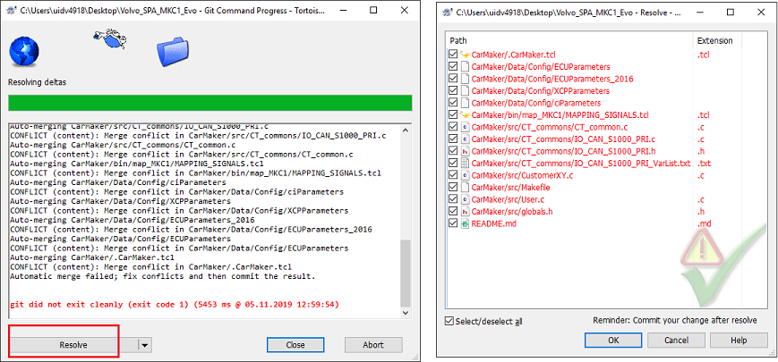  
    &nbsp;  
    After clicking 'Ok', Git tries to resolve as much as possible itself. But most probably you will end up with the window on the above left which gives you the possibility to ``Resolve`` the Merging issues. After clicking on 'Resolve' you get an overview of all files which contain potential problems. We will go through them one by one.  When we 'Right-Click' a file, we get the following dialogue:  
    &nbsp;  
      
    &nbsp;  
    One of the three possibilities is usually chosen:  
        - `Edit Conflicts` opens the Editor in which we go through all lines (usually the way to go).
        - `Resolve conflict using "MERGE_HEAD"` is selected when you are sure that the changes from the remote are all valid. The local file is then overwritten completely with the remote content.
        - `Resolve conflict using "HEAD"` is selected when you are sure that all the changes from remote can be discarded and only your local file with its contents is valid.  
    &nbsp;  
    In case you selected `Edit Conflicts` the following dialogue opens:  
    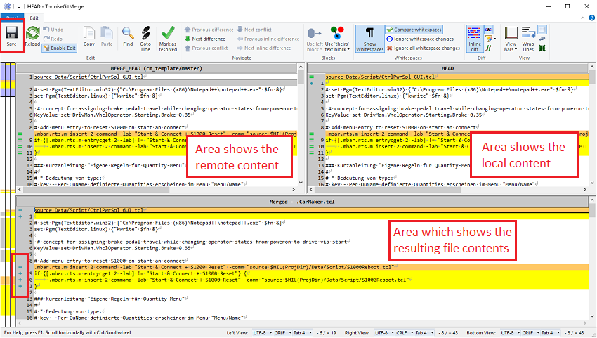  
    &nbsp;  
    The dialogue above has three areas: The upper left shows the file content from the remote server (so in our case the most recent *CM_Template* changes). The upper right shows the file content of your `HEAD` on your local machine (so your last local commit of your project) and the lower window is the resulting file contents. Here you are supposed to choose from the two upper files your resulting file contents. On the left of the lower window you can see the lines Git already did merge for you (`-` for removed line and `+` for added or edited line). Yellow and orange areas are usually already fine, so no work has to be done. It won't hurt to check anyhow to be sure nothing went wrong.  
    If you are finished with the file and sure that everything is in place you click `Save` in the upper left. The dialogue below appears in which you select `Mark as resolved` and you are done with this file. It disappears from the file overview in the previous dialogue.  
    &nbsp;  
    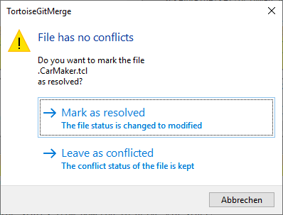  
    &nbsp;  
    Red areas, as seen in the image below, are critical areas which need the attention of the project responsible:  
    &nbsp;  
      
    &nbsp;  
    Select the whole red block in the lower window and do a 'Right-Click' - the dialogue above appears.  
    Three options are described:  
          - `Use text block from left` takes over the changes from the left Only (CM_Template contents).
          - `Use text block from right` takes over the changes from the right only (local project contents).
          - `Use text block from left before right` takes over the changes from the CM_Template side and puts the local contents below (often used).  
    &nbsp;  
    If you are finished with the file and sure that everything is in place you click `Save` and select `Mark as resolved`.  
    &nbsp;  
  3. Check all files with `Diff` before final Commit  
    After you resolved all files in the list you are almost finished. To fulfill the Merge, you need to Commit your resolved files. Before we do that, it is necessary to check once again if no project files have taken harm in the process. For this select `Diff` in the TortoiseGit submenu. Result is the following dialogue:  
    &nbsp;  
    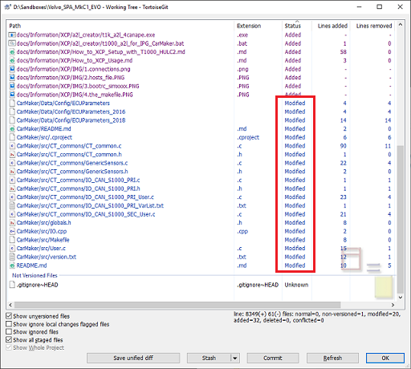  
    &nbsp;  
    Interesting for us are the files which are marked as `Modified`. Double click on each file one after the other and check for all differences.   
    &nbsp;  
      
    &nbsp;  
    A *diff* window appears, which shows the currently committed file content on the left and the current 'Working Directory' content on the right. Go through all differences and check again that no project content was overwritten unintentionally. Often the button `Use left block` can be used to just take over the old project content. After all files were checked, click ``Commit`` to check in the updated files.   

  4. Compile your project and make a final check on the simulator
    &nbsp;  
  5. `Push` your local changes to your fork. In case of problems, do a [hard remote overwrite.](#link010)

&nbsp;
<table>
  <thead>
    <tr>
      <th style="text-align: left"><a href="#top">&larr; Back to Top</a></th>
    </tr>
  </thead>
</table>

&nbsp;

### <a name="link012"></a> ... the password for accessing the GitHub server ("fatal: Authentication failed" - Error ).

The password is stored in the Windows credential manager and needs to be updated.  

(only in German Windows at the moment)

- In **Windows Startmenu**   

  1. Enter 'Systemsteuerung' and select the "Desktop App".    
  2. Select 'Benutzerkonten' &nbsp; &rarr; &nbsp; 'Anmeldeinformationsverwaltung' &nbsp; &rarr; &nbsp; 'Windows-Anmeldeinformation' &nbsp; &rarr; &nbsp; in the menu on the bottom select 'git:http//:github.conti.de' (see below)
  &nbsp;  
  &nbsp;  
  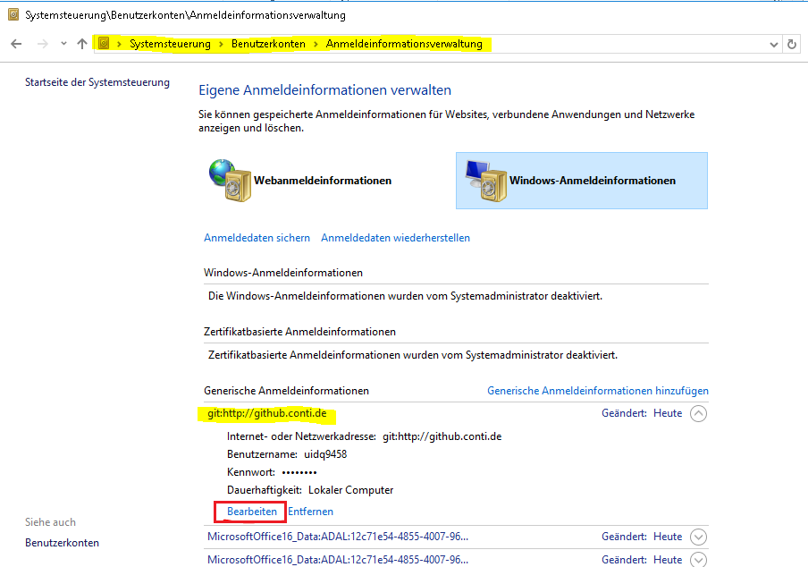  
  &nbsp;
  3. Change your password and retry your git command.


&nbsp;
<table>
  <thead>
    <tr>
      <th style="text-align: left"><a href="#top">&larr; Back to Top</a></th>
    </tr>
  </thead>
</table>

&nbsp;

***

# Undo...

### <a name="link016"></a> ... a Commit or 'Going back to an old project state'.

&nbsp;

- In **Git BASH**  

  Possibility 1:  
  To go back to a point in time before a certain Commit, use  
  ```git
  >> git reflog                    // List of everything done in git, across all branches
                                   // Each entry has an 'index' in HEAD@{index}
  >> git reset HEAD@{index}        // Command sets the HEAD pointer to project state at 'index'
  >> git checkout .                // Checks out the state at the selected HEAD index
  ```  

  Possibility 2:  
  To go back to a certain Release Tag, use  
  ```git
  >> git tag                       // List of all release tags
  >> git reset <tag_name>          // Command sets the HEAD pointer to project state at release <tag_name>
  >> git reset --hard              // Reset the project state to the selected release
  ```  

&nbsp;

- In **TortoiseGit**

   tbd


&nbsp;
<table>
  <thead>
    <tr>
      <th style="text-align: left"><a href="#top">&larr; Back to Top</a></th>
    </tr>
  </thead>
</table>

&nbsp;

### <a name="link008"></a> ... changes made to files in your Working Directory.

&nbsp;

- In **Git BASH**  
  To discard changes made to files (or all files) in your local working directory, use  
  ```git
  >> git checkout .                // resets all files in folder (and subfolders) to repository HEAD revision
  or
  >> git checkout -- <file_name>   // resets file 'file_name' to repository HEAD revision
  or
  >> git checkout -- <path>/*      // resets all files in subpath <path> to repository HEAD revision
  ```  
  Changes that were already made to `Index` (by `add` files) remain untouched.
&nbsp;

- In **TortoiseGit**  

  To revert changes made <u>to a single file</u>, select `Show Log` in the TortoiseGit submenu. In the new dialogue go to the top box and navigate to the Commit you want to revert your file to. Afterwards right-click the file you want to revert in the lower box.  
  Click here `Revert to this revision` which leads to the file being reverted.  
  &nbsp;
  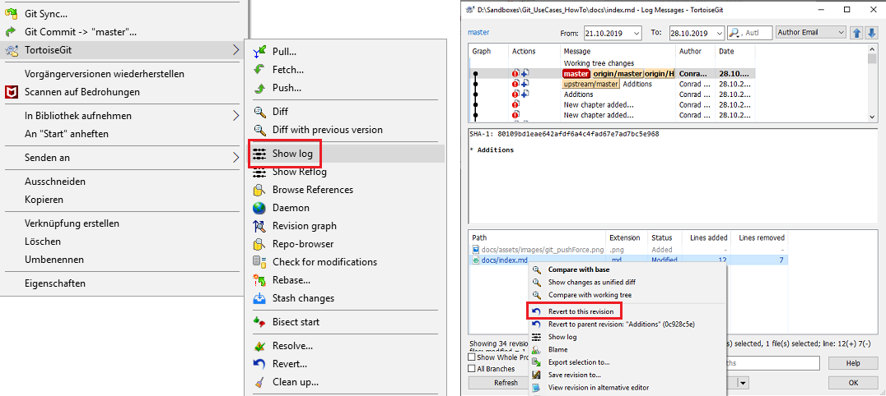  

  &nbsp;

  To revert <u>all changes</u> in the *Working Directory* to a previous Commit, first select `Show Log` in the TortoiseGit submenu.  
  1.  In the upper box select the Commit you want to reset to and right-click on it.  Now select `Reset 'master' to this ...`  
       
    &nbsp;
  2. Set the `Reset Type` to *Soft* or *Mixed* to keep the files in your *Working Directory* untouched and click *OK*.  
         


&nbsp;
<table>
  <thead>
    <tr>
      <th style="text-align: left"><a href="#top">&larr; Back to Top</a></th>
    </tr>
  </thead>
</table>

&nbsp;

### <a name="link009"></a> ... the last commit in your Working Directory to your Local Repository.

&nbsp;

- In **Git BASH**
  ```git
  >> git reset --soft HEAD~1
  ```
   `reset` will rewind your current HEAD branch to the specified revision. Above command resets the HEAD to the one before the current revision - effectively making our last commit undone.  
   The `--soft` flag makes sure that the changes in undone revisions are preserved. After running the command, you'll find the changes as uncommitted local modifications in your working copy.  

- In **TortoiseGit**  

  1. Right click on the repository folder and select `Show Log` in the TortoiseGit submenu.  
    In the upper box select the Commit you want to reset to, in this case the 2nd one from top, and right-click on it.  
    Now select `Reset 'master' to this ...`  
       
    &nbsp;
  2. Set the `Reset Type` to *Soft* or *Mixed* to keep the files in your *Working Directory* untouched and click *OK*.  
       

&nbsp;
<table>
  <thead>
    <tr>
      <th style="text-align: left"><a href="#top">&larr; Back to Top</a></th>
    </tr>
  </thead>
</table>

&nbsp;

### <a name="link010"></a> ... a former push to remote (or 'Overwrite a remote hard with the current local contents').

&nbsp;

- In **Git BASH**
  ```git
  >> git push origin master --force
  ```
  This will overwrite the remote repository (here: `origin/master`) with the current local files, even when the remote repository is ahead.

- In **TortoiseGit**  

    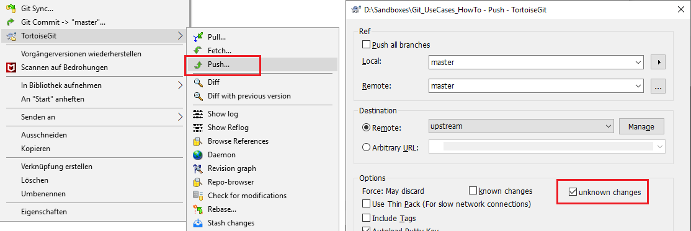   

    Set the `unknown changes` box. This does not check any server commits, so it is possible to lose unknown changes on the remote.  
    This will overwrite the remote repository (here: `upstream/master`) with the current local files, even when the remote repository is ahead.

&nbsp;
<table>
  <thead>
    <tr>
      <th style="text-align: left"><a href="#top">&larr; Back to Top</a></th>
    </tr>
  </thead>
</table>

&nbsp;

### <a name="link017"></a> ... a former file deletion (or 'Retrieve a file that was deleted in a former Commit').

&nbsp;

- In **Git BASH**
  ```git
  // (1) Retrieve commit id from the point the file was deleted:

  >> git log -- *part_of_file_name*

  // (2) Copy commit id from log

  // (3) Restore deleted file:
  >> git checkout <commit_id>~1 path/of/file
  ```
  This will put the file into its former place in the project (path/to/file).  
  *Add* and *Commit* it afterwards.

&nbsp;
<table>
  <thead>
    <tr>
      <th style="text-align: left"><a href="#top">&larr; Back to Top</a></th>
    </tr>
  </thead>
</table>

&nbsp;

***

# Remove...

### <a name="link014"></a> ... a single local file from the staging area ('Un-add' a file).  
This command will remove a previously added file from `Index`. This will only work if the file has not been commited yet.  
The file itself is not harmed and will stay where it is.

- In **Git BASH**  
  ```git
  >> git rm --cached path/to/file_to_remove
  ```
&nbsp;

- In **TortoiseGit**  

  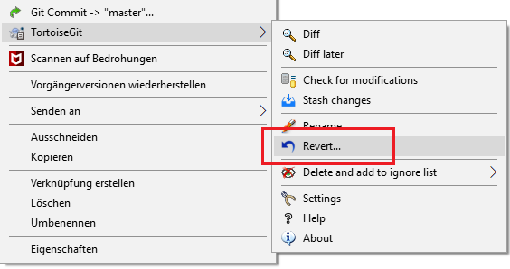   

  The command will remove the file from the staging area.

&nbsp;
<table>
  <thead>
    <tr>
      <th style="text-align: left"><a href="#top">&larr; Back to Top</a></th>
    </tr>
  </thead>
</table>

&nbsp;

### <a name="link015"></a> ... a single file from your repository (locally and on GitHub).  
This command will remove a previously committed file from the repository and furthermore clean all references in the entire repository history. Also it will remove the file from disk, so make a copy of it somewhere if you want to keep it.  

- In **Git BASH**  

  1. Replace in the following command 'path/to/file_to_remove' with the proper file path and execute the command.
    ```
      >> git filter-branch --force --index-filter "git rm --cached --ignore-unmatch path/to/file_to_remove" \
       --prune-empty --tag-name-filter cat -- --all
    ```  
    As a result, the file should be removed from the repository and from the directory.  
    Additionally, the commit history should be cleaned of this file.  
  &nbsp;  
  2. If required, copy your file back to the directory and add it to .gitignore to ensure that you don't accidentally commit it again.  
    ```
      >> echo "path/to/file_to_remove" >> .gitignore
      >> git add .gitignore
      >> git commit -m ".gitignore added"
    ```  
  3. Once you're done, force-push your local changes to overwrite your GitHub repository:  
    ```
      >> git push origin master --force --all
    ```  

&nbsp;
<table>
  <thead>
    <tr>
      <th style="text-align: left"><a href="#top">&larr; Back to Top</a></th>
    </tr>
  </thead>
</table>

&nbsp;

***

# Check...

### <a name="link011"></a> ... commit history to view file content differences.  

The easiest way to check the history of a project and the files within it, is to go in GitHub and go through the `Commit` history.  
GitHub has an integrated file comparison view, where you can see what has changed in every single file in every commit made in the past.  

- In **GitHub**  

  1. Navigate to the repository you want to look at - usually a subrepository of &nbsp;[VED-CarMaker-HIL](http://github.conti.de/pages/VED-CarMaker-HIL).  
  2. In the first Tab `<> Code`, there is a link to the commit history, also displaying the number of commits overall.  
    &nbsp;  
  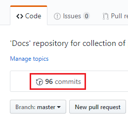  
  &nbsp;  
  3. Click on it and the commit history is shown with the dates and the commit messages which, in the best case, describe what was done at this point in time.  
  4. Now select the commit you want to investigate and click on it. As a result it shows all files that were edited with the removed parts (`-`) and the newly added parts (`+`).  
  &nbsp;  
    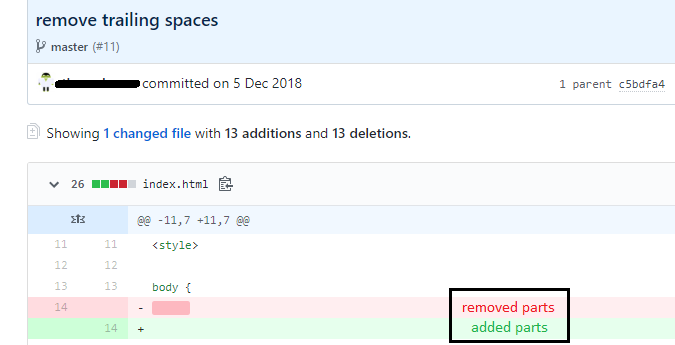  
  &nbsp;  


&nbsp;
<table>
  <thead>
    <tr>
      <th style="text-align: left"><a href="#top">&larr; Back to Top</a></th>
    </tr>
  </thead>
</table>

&nbsp;

***

&nbsp;

## <a name="freqBash"></a>Frequently used commands  

```git
>> git remote -v                    // prints all configured remotes of the repository

>> git status                       // prints the status of the current branch and its files

>> git log                          // prints the most recent commits and additional information

>> git checkout <branch_name>       // change current scope to branch <branch_name>

>> git reflog                       // list of every thing you've done in git, across all branches!

>> git reset HEAD@{index}           // Going back to old project state ('index' can be seen in 'git reflog')

>> ...
```

&nbsp;

<table>
  <thead>
    <tr>
      <th style="text-align: left"><a href="#top">&larr; Back to Top</a></th>
    </tr>
  </thead>
</table>

&nbsp;

***

&nbsp;

&nbsp;

[Back](../)
