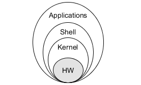

[Back](../)

&nbsp;

# Misc
---  

&nbsp;

Misc Basics  
&nbsp;&nbsp;&nbsp;[Rechnerarchitektur](#link001)

&nbsp;

Compiler  
&nbsp;&nbsp;&nbsp;[Die Phasen eines Compilers](#link002)

&nbsp;

Jenkins  
&nbsp;&nbsp;&nbsp;[Basics](#link003)  
&nbsp;&nbsp;&nbsp;[Block descriptions](#link004)  

&nbsp;

---

&nbsp;

&nbsp;

# Misc Basics

### <a name="link001"></a> Rechnerarchitektur
  

- `Kernel`: Interacts with hardware to perform memory management, task scheduling and file management. Technically, the Kernel "is" the OS.  
- `Shells`: Textual command line shells. Processes user requests - commands are translated by the shell into something the Kernel can understand

&nbsp;

---  

&nbsp;

# Compiler

### <a name="link002"></a> Die Phasen eines Compilers
  

&nbsp;

---  

&nbsp;

# Jenkins

### <a name="link003"></a> Basics  

`Jenkins` is an open source 'continous integration' server that provides the ability to `continously perform automated builds and tests`. Several tasks can be controlled and monitored by Jenkins, including pulling code from a repository, performing static code analysis, building your project, exceuting unit tests, automated tests and/or performance tests and finally deploying your application. These tasks typically conform a contimous delivery pipeline.  

`Pipelines` are a suite of Jenkins plugins. Pipelines can be seen as a sequence of stages to perform the tasks, just detailed, among others, thus providing continous releases of your application.  

Staring with `Jenkins 2.0`, the pipeline functionality comes right out of the box, meaning that no configuration needs to be made to be able to create them. Another improvement is that pipelines can be specified as code, enabling you to develop a pipeline script and add it to your code repository so you can version it.  

With the introduction of the Pipeline, Jenkins added an embedded `Groovy engine`, making Groovy the scripting language in the Pipeline's DSL (domain-specific-language).  

To create your Jenkins pipeline script, there are specific sentences or elements to define script selections, which follow the Groovy syntax.

&nbsp;

> Immer darauf achten angemeldet zu sein, da ansonsten gewisse Funktionen nicht freigeschaltet sind in der Jenkins Homepage.

> Um 'Jenkinsfile'-Inhalt zu testen ist 'Best-Practice' der Gebrauch der `Replay`-Funktion in der Jenkins-Browser-Applikation. Dafür Auswahl eines alten Builds und dann im Menü links anklicken von "REPLAY".

&nbsp;

### <a name="link004"></a> Block descriptions  

**`Node` blocks**  

The first block to be defined is the `node`
```
node {
    ...
} 

// or

node (<label>) {
    ...
}
```
A 'node' is part of the Jenkins distributed mode architecture, where the workload can be delegated to multiple "agent" nodes. A "master" node handles all the tasks in your environment.  

This block is not mandatory but is desired and can be considered as good practice, since with the code included in this block, Jenkins will schedule and run all the steps once any node is available and creates a specific work space directory.  

`label` := Computer name, label name or any other label expression to restrict where this step builds. May be left blank in which case any available executor is taken, e.g.  
*'master'*: This block may only be executed on the Jenkins 'master'.  
*'linux-machine-42'*: This block may only be executed on the agent with the name 'linux-machine-42'.  

> A node specifies <u>where</u> something shall happen.  

&nbsp;

**`Stage` blocks**  

The next required section is the `stage`  
```
stage {
    ...
} 

// or

stage (<label>) {
    ...
}
```
Your pipeline will consist of several steps that can be grouped in 'stages'. Among these stages you might have:  
- Pull code from repository
- Build your project
- Deploy your application
- Perform functional tests
- Perform performance tests

Each of these can include more than one option. For example, a stage to deploy your application can consist of copying the files to a specific environment for functional tests and to a dedicated server for performance tests. And once files are copied successfully, proceed to deploy it.  

Stage blocks are also optional, but they are recommended because they provide an organized way of specifying tasks to be executed in the script.  

'Stage' blocks also show up in the Jenkins job homepage in the Browser as independent blocks. So they are also important in visual terms, as they help to visualize where a Pipeline failed eventually or how long a certain stage took.  

&nbsp;

**`ws` block**  

Allocate workspace: `ws (string 'dir') {...}`  

Ensure that nothing else interferes with the location on disk where you are running the enclosed steps.  

'dir' := A workspace is automatically allocated for you with the 'node' step, or you can get an alternate workspace with this 'ws' step, but by default the location is chosen automatically. You can instead specify a path here and that workspace will be locked instead (the path may be relative to the slave root, or absolute).  

&nbsp;

**`bat` block**  

Executes a batch script: `bat (script: <script>`  

\<script\> := Executes a Batch script. Multiple lines allowed. When using the 'returnStdOut' flag, you probably wish to prefix this with '\@', lest the command itself be included in the output.  

Optional parameters:  `encoding`, `label`, `resturnStatus`, `returnStdOut`  

&nbsp;

&nbsp;

[Back](../)
