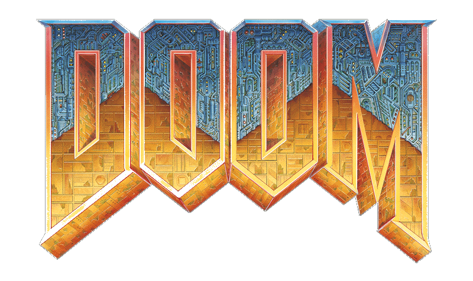
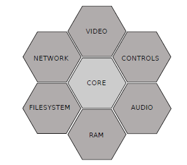
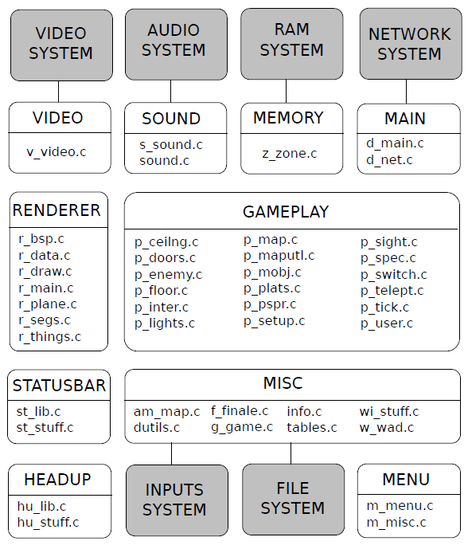
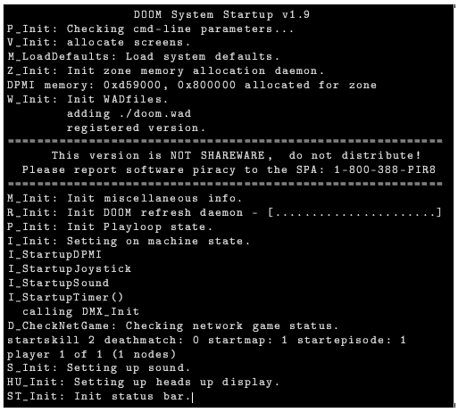

[Back](../../)

&nbsp;

# Doom <font size="-1">(1993 - id Software)</font>  

---

    

&nbsp;

<font size="-1">&rarr; Information taken from "Game Engine Black Book DOOM" (F.Sanglard)  </font>  

<font size="-1">&rarr; Code taken from <a href="https://github.com/id-Software/DOOM">here.</a></font>  

&nbsp;

## Architecture

### API 

To be able to run on different operating systems Doom has a common *"core"* that is platform independent. To perform I/O, the *core* would tap into sub-systems specific to the platform they targeted.  

  
DOOM’s core and its I/O platform-dependent systems. Notice the similarities with the design of an operating system.

In the case of the video system, it would be using the VGA hardware on MS-DOS but the `NSWindow` API on NeXT . A naive implementation would have required a function pointer acting as a layer of indirection to dispatch each I/O call. A better solution leveraged C’s linking stage.  

While building a C program, all compilation units (`.c` files) are compiled independently. At the end of the compilation step, all `.c` files have been transformed into object (`.o`) files. Object files may reference each other but because they were created independently, they have "holes" called "unresolved symbols". To generate an executable, all objects are given to a linker which will recognize unresolved symbols from all objects and patch the holes.  

Taking the example of `s_sound.c` which is part of the core and looking at `s_sound.o`, we can see this translation unit uses functions such as `I_PlaySong` and `I_StartSound` which are defined in the platform-specific sound system.  

Asking nm for undefined symbols shows an object file’s "holes".  

```c
$ nm -u s_sound .o | grep I_

U _I_Error
U _I_GetSfxLumpNum
U _I_PauseSong
U _I_PlaySong
U _I_RegisterSong
U _I_ResumeSong
U _I_SetChannels
U _I_SetMusicVolume
U _I_SoundIsPlaying
U _I_StartSound
U _I_StopSong
U _I_StopSound
U _I_UnRegisterSong
U _I_UpdateSoundParams
```

After the linker is done, there are no more unresolved symbols. The final executable is ready to run.  

&nbsp;

### Source Code Architecture  

  

In white are the core components. In grey are the I/O systems which require platformspecific code.  
On DOS these are provided by six extra files: `i_main.c`, `i_ibm.c`, `planar.asm`, `i_ibm_a.asm`, `i_sound.c`, and `i_cyber.c`.  

Notice the prefixed file names in the figure above. Since C has no namespaces, these prefixes are also applied to function names. `I_` stands for "implementation-specific", `P_` gameplay, `R_` is for renderer and so on.  

The beauty of this architecture is that once the platform-specific systems are written, there is zero overhead to writing code that runs on multiple platforms. Most of the code goes into the core and the platform-specific code needs not be touched any more.  

Because portability was not an afterthought but an integral part of the development process, DOOM’s code layering is never violated. This rigorous design partly explains why DOOM has been ported to so many systems: there is very little code to write.  

&nbsp;

### Startup  

The developers did not try to hide what was going on during startup. DOOM’s openness needed no splash screen. The text mode messages show the player what is going on behind the scenes (figure below). For each initializer a line is output to the extent that the DOS screen on the right closely mirrors the source code in `D_DoomMain`.  

The startup step was fairly fast except for the excruciating renderer initialization in `R_Init` which took forever to complete. It featured not only a line but also a progress bar made up of dots which often required up to a minute to complete on the full version depending on the machine’s hard drive access time.  

  

&nbsp;

---

&nbsp;

## Code Walkthrough  

Exploring a source code repository always starts with finding out what the OS will select as the entry point. 99% of the time it means finding the `int main(int,char**)` function.  

In the case of DOOM there is one entry point per OS and they are all in implementation specific `(I_*)` files. For DOS it is in `i_main.c`. Regardless of the platform, all entry points converge on the core main function named `D_DoomMain` located in `d_main.c`.  

```c
    # include "doomdef.h"

    void main ( int argc , char ** argv ) {
        myargc = argc ;
        myargv = argv ;
        D_DoomMain ();
    }                                               /* i_main .c */
```  

```c
    void D_DoomMain ( void ) {
        FindResponseFile ();        // Search doom .wad , doom1 . wad ...
        IdentifyVersion ();         // shareware or registered ?

        V_Init ();                  // Video system .
        M_LoadDefaults ();          // Load params from default . cfg
        Z_Init ();                  // Zone Memory Allocator
        M_Init ();                  // Menu
        R_Init ();                  // Renderer
        P_Init ();                  // gamePlay
        I_Init ();                  // Implementation dependant
        D_CheckNetGame ();          //
        S_Init ();                  // Sound
        HU_Init ();                 // HUD
        ST_Init ();                 // Status Bar

        D_DoomLoop ();              // never returns
    }                                             /* d_main .c */
```

No surprises in `D_DoomMain`, the engine begins by initializing all its sub-systems before jumping to a loop which will never return (`D_DoomLoop`).  

The game engine executable which shipped with the registered version of the game was the same that shipped with the shareware version. Two functions, `FindResponseFile` and `IdentifyVersion`, simply looked for the asset file and switched a flag depending on what WAD had been found (`DOOM1.WAD` or `DOOM.WAD`).  

