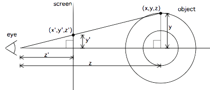
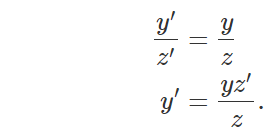
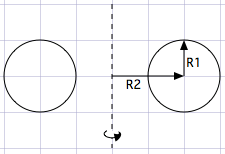
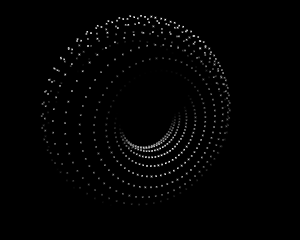

[Back](../../)

&nbsp;

# Revolving Donut
---

&nbsp; 

Originally from [here](https://www.a1k0n.net/2011/07/20/donut-math.html).  


  

&nbsp; 

At its core, it’s a framebuffer and a [Z-buffer](https://en.wikipedia.org/wiki/Z-buffering) into which I render pixels. Since it’s just rendering relatively low-resolution ASCII art, I massively cheat. All it does is plot pixels along the surface of the torus at fixed-angle increments, and does it densely enough that the final result looks solid. The “pixels” it plots are ASCII characters corresponding to the illumination value of the surface at each point: ``.,-~:;=!*#$@`` from dimmest to brightest. No raytracing required.  

So how do we do that? Well, let’s start with the basic math behind 3D perspective rendering. The following diagram is a side view of a person sitting in front of a screen, viewing a 3D object behind it.  

&nbsp; 

  

&nbsp; 

To render a 3D object onto a 2D screen, we project each point (x,y,z) in 3D-space onto a plane located z’ units away from the viewer, so that the corresponding 2D position is (x’,y’). Since we’re looking from the side, we can only see the y and z axes, but the math works the same for the x axis (just pretend this is a top view instead). This projection is really easy to obtain: notice that the origin, the y-axis, and point (x,y,z) form a right triangle, and a similar right triangle is formed with (x’,y’,z’). Thus the relative proportions are maintained:  

  

So to project a 3D coordinate to 2D, we scale a coordinate by the screen distance z’. Since z’ is a fixed constant, and not functionally a coordinate, let’s rename it to K1, so our projection equation becomes **(x′,y′)=(K1\*x/z,K1\*y/z)**. We can choose K1 arbitrarily based on the field of view we want to show in our 2D window. For example, if we have a 100x100 window of pixels, then the view is centered at (50,50); and if we want to see an object which is 10 units wide in our 3D space, set back 5 units from the viewer, then K1 should be chosen so that the projection of the point x=10, z=5 is still on the screen with x’ < 50: 10K1/5 < 50, or K1 < 25.

When we’re plotting a bunch of points, we might end up plotting different points at the same (x’,y’) location but at different depths, so we maintain a z-buffer which stores the z coordinate of everything we draw. If we need to plot a location, we first check to see whether we’re plotting in front of what’s there already. It also helps to compute z^-1 =1/z and use that when depth buffering because:

- z^-1 = 0 corresponds to infinite depth, so we can pre-initialize our z-buffer to 0 and have the background be infinitely far away  
- we can re-use z^-1 when computing x’ and y’: Dividing once and multiplying by z^-1 twice is cheaper than dividing by z twice.  

Now, how do we draw a donut, AKA torus? Well, a torus is a solid of revolution, so one way to do it is to draw a 2D circle around some point in 3D space, and then rotate it around the central axis of the torus. Here is a cross-section through the center of a torus:  

&nbsp; 

  

&nbsp; 

So we have a circle of radius R1 centered at point (R2,0,0), drawn on the xy-plane. We can draw this by sweeping an angle — let’s call it θ — from 0 to 2π:  

  

&nbsp;


Now we take that circle and rotate it around the y-axis by another angle — let’s call it φ. To rotate an arbitrary 3D point around one of the cardinal axes, the standard technique is to multiply by a [rotation matrix](https://de.wikipedia.org/wiki/Drehmatrix). So if we take the previous points and rotate about the y-axis we get:  

  

&nbsp;

But wait: we also want the whole donut to spin around on at least two more axes for the animation. They were called A and B in the original code: it was a rotation about the x-axis by A and a rotation about the z-axis by B. This is a bit hairier, so I’m not even going write the result yet, but it’s a bunch of matrix multiplies.  

  

&nbsp;

Churning through the above gets us an (x,y,z) point on the surface of our torus, rotated around two axes, centered at the origin. To actually get screen coordinates, we need to:  

- Move the torus somewhere in front of the viewer (the viewer is at the origin) — so we just add some constant to z to move it backward.  
- Project from 3D onto our 2D screen.  
  
So we have another constant to pick, call it K2, for the distance of the donut from the viewer, and our projection now looks like:  

  

K1 and K2 can be tweaked together to change the field of view and flatten or exaggerate the depth of the object.  

Now, we could implement a 3x3 matrix multiplication routine in our code and implement the above in a straightforward way. But if our goal is to shrink the code as much as possible, then every 0 in the matrices above is an opportunity for simplification. So let’s multiply it out. Churning through a bunch of algebra (thanks Mathematica!), the full result is:  

  

&nbsp;

Well, that looks pretty hideous, but we we can precompute some common subexpressions (e.g. all the sines and cosines, and **R2 + R1\*cos θ**) and reuse them in the code. In fact I came up with a completely different factoring in the original code but that’s left as an exercise for the reader. (The original code also swaps the sines and cosines of A, effectively rotating by 90 degrees, so I guess my initial derivation was a bit different but that’s OK).  

Now we know where to put the pixel, but we still haven’t even considered which shade to plot. To calculate illumination, we need to know the [surface normal](https://en.wikipedia.org/wiki/Normal_(geometry)) — the direction perpendicular to the surface at each point. If we have that, then we can take the [dot product](https://de.wikipedia.org/wiki/Skalarprodukt) of the surface normal with the light direction, which we can choose arbitrarily. That gives us the cosine of the angle between the light direction and the surface direction: If the dot product is >0, the surface is facing the light and if it’s <0, it faces away from the light. The higher the value, the more light falls on the surface.  

The derivation of the surface normal direction turns out to be pretty much the same as our derivation of the point in space. We start with a point on a circle, rotate it around the torus’s central axis, and then make two more rotations. The surface normal of the point on the circle is fairly obvious: it’s the same as the point on a unit (radius=1) circle centered at the origin.  

So our surface normal (Nx, Ny, Nz) is derived the same as above, except the point we start with is just (cos θ, sin θ, 0). Then we apply the same rotations:  

  

&nbsp;

So which lighting direction should we choose? How about we light up surfaces facing behind and above the viewer: **(0,1,−1)**. Technically this should be a normalized unit vector, and this vector has a magnitude of √2. That’s okay – we will compensate later. Therefore we compute the above (x,y,z), throw away the x and get our luminance L = y-z.  

  

Again, not too pretty, but not terrible once we’ve precomputed all the sines and cosines.

So now all that’s left to do is to pick some values for R1, R2, K1, and K2. In the original donut code I chose R1=1 and R2=2, so it has the same geometry as my cross-section diagram above. K1 controls the scale, which depends on our pixel resolution and is in fact different for x and y in the ASCII animation. K2, the distance from the viewer to the donut, was chosen to be 5.  

I’ve taken the above equations and written a quick and dirty canvas implementation here, just plotting the pixels and the lighting values from the equations above. The result is not exactly the same as the original as some of my rotations are in opposite directions or off by 90 degrees, but it is qualitatively doing the same thing. Here it is:  

  

&nbsp;

Now, we have all the pieces, but how do we write the code? Roughly like this (some pseudocode liberties have been taken with 2D arrays):  

```c
const float theta_spacing = 0.07;
const float phi_spacing   = 0.02;

const float R1 = 1;
const float R2 = 2;
const float K2 = 5;
// Calculate K1 based on screen size: the maximum x-distance occurs
// roughly at the edge of the torus, which is at x=R1+R2, z=0.  we
// want that to be displaced 3/8ths of the width of the screen, which
// is 3/4th of the way from the center to the side of the screen.
// screen_width*3/8 = K1*(R1+R2)/(K2+0)
// screen_width*K2*3/(8*(R1+R2)) = K1
const float K1 = screen_width*K2*3/(8*(R1+R2));

render_frame(float A, float B) {
  // precompute sines and cosines of A and B
  float cosA = cos(A), sinA = sin(A);
  float cosB = cos(B), sinB = sin(B);

  char output[0..screen_width, 0..screen_height] = ' ';
  float zbuffer[0..screen_width, 0..screen_height] = 0;

  // theta goes around the cross-sectional circle of a torus
  for (float theta=0; theta < 2*pi; theta += theta_spacing) {
    // precompute sines and cosines of theta
    float costheta = cos(theta), sintheta = sin(theta);

    // phi goes around the center of revolution of a torus
    for(float phi=0; phi < 2*pi; phi += phi_spacing) {
      // precompute sines and cosines of phi
      float cosphi = cos(phi), sinphi = sin(phi);
    
      // the x,y coordinate of the circle, before revolving (factored
      // out of the above equations)
      float circlex = R2 + R1*costheta;
      float circley = R1*sintheta;

      // final 3D (x,y,z) coordinate after rotations, directly from
      // our math above
      float x = circlex*(cosB*cosphi + sinA*sinB*sinphi)
        - circley*cosA*sinB; 
      float y = circlex*(sinB*cosphi - sinA*cosB*sinphi)
        + circley*cosA*cosB;
      float z = K2 + cosA*circlex*sinphi + circley*sinA;
      float ooz = 1/z;  // "one over z"
      
      // x and y projection.  note that y is negated here, because y
      // goes up in 3D space but down on 2D displays.
      int xp = (int) (screen_width/2 + K1*ooz*x);
      int yp = (int) (screen_height/2 - K1*ooz*y);
      
      // calculate luminance.  ugly, but correct.
      float L = cosphi*costheta*sinB - cosA*costheta*sinphi -
        sinA*sintheta + cosB*(cosA*sintheta - costheta*sinA*sinphi);
      // L ranges from -sqrt(2) to +sqrt(2).  If it's < 0, the surface
      // is pointing away from us, so we won't bother trying to plot it.
      if (L > 0) {
        // test against the z-buffer.  larger 1/z means the pixel is
        // closer to the viewer than what's already plotted.
        if(ooz > zbuffer[xp,yp]) {
          zbuffer[xp, yp] = ooz;
          int luminance_index = L*8;
          // luminance_index is now in the range 0..11 (8*sqrt(2) = 11.3)
          // now we lookup the character corresponding to the
          // luminance and plot it in our output:
          output[xp, yp] = ".,-~:;=!*#$@"[luminance_index];
        }
      }
    }
  }

  // now, dump output[] to the screen.
  // bring cursor to "home" location, in just about any currently-used
  // terminal emulation mode
  printf("\x1b[H");
  for (int j = 0; j < screen_height; j++) {
    for (int i = 0; i < screen_width; i++) {
      putchar(output[i,j]);
    }
    putchar('\n');
  }
  
}
```  

&nbsp;


***  

&nbsp;


The Javascript source for both the ASCII and canvas rendering is  

```js
(function() {
var _onload = function() {
  var pretag = document.getElementById('d');
  var canvastag = document.getElementById('canvasdonut');

  var tmr1 = undefined, tmr2 = undefined;
  var A=1, B=1;

  // This is copied, pasted, reformatted, and ported directly from my original
  // donut.c code
  var asciiframe=function() {
    var b=[];
    var z=[];
    A += 0.07;
    B += 0.03;
    var cA=Math.cos(A), sA=Math.sin(A),
        cB=Math.cos(B), sB=Math.sin(B);
    for(var k=0;k<1760;k++) {
      b[k]=k%80 == 79 ? "\n" : " ";
      z[k]=0;
    }
    for(var j=0;j<6.28;j+=0.07) { // j <=> theta
      var ct=Math.cos(j),st=Math.sin(j);
      for(i=0;i<6.28;i+=0.02) {   // i <=> phi
        var sp=Math.sin(i),cp=Math.cos(i),
            h=ct+2, // R1 + R2*cos(theta)
            D=1/(sp*h*sA+st*cA+5), // this is 1/z
            t=sp*h*cA-st*sA; // this is a clever factoring of some of the terms in x' and y'

        var x=0|(40+30*D*(cp*h*cB-t*sB)),
            y=0|(12+15*D*(cp*h*sB+t*cB)),
            o=x+80*y,
            N=0|(8*((st*sA-sp*ct*cA)*cB-sp*ct*sA-st*cA-cp*ct*sB));
        if(y<22 && y>=0 && x>=0 && x<79 && D>z[o])
        {
          z[o]=D;
          b[o]=".,-~:;=!*#$@"[N>0?N:0];
        }
      }
    }
    pretag.innerHTML = b.join("");
  };

  window.anim1 = function() {
    if(tmr1 === undefined) {
      tmr1 = setInterval(asciiframe, 50);
    } else {
      clearInterval(tmr1);
      tmr1 = undefined;
    }
  };

  // This is a reimplementation according to my math derivation on the page
  var R1 = 1;
  var R2 = 2;
  var K1 = 150;
  var K2 = 5;
  var canvasframe=function() {
    var ctx = canvastag.getContext('2d');
    ctx.fillStyle='#000';
    ctx.fillRect(0, 0, ctx.canvas.width, ctx.canvas.height);

    if(tmr1 === undefined) { // only update A and B if the first animation isn't doing it already
      A += 0.07;
      B += 0.03;
    }
    // precompute cosines and sines of A, B, theta, phi, same as before
    var cA=Math.cos(A), sA=Math.sin(A),
        cB=Math.cos(B), sB=Math.sin(B);
    for(var j=0;j<6.28;j+=0.3) { // j <=> theta
      var ct=Math.cos(j),st=Math.sin(j); // cosine theta, sine theta
      for(i=0;i<6.28;i+=0.1) {   // i <=> phi
        var sp=Math.sin(i),cp=Math.cos(i); // cosine phi, sine phi
        var ox = R2 + R1*ct, // object x, y = (R2,0,0) + (R1 cos theta, R1 sin theta, 0)
            oy = R1*st;

        var x = ox*(cB*cp + sA*sB*sp) - oy*cA*sB; // final 3D x coordinate
        var y = ox*(sB*cp - sA*cB*sp) + oy*cA*cB; // final 3D y
        var ooz = 1/(K2 + cA*ox*sp + sA*oy); // one over z
        var xp=(150+K1*ooz*x); // x' = screen space coordinate, translated and scaled to fit our 320x240 canvas element
        var yp=(120-K1*ooz*y); // y' (it's negative here because in our output, positive y goes down but in our 3D space, positive y goes up)
        // luminance, scaled back to 0 to 1
        var L=0.7*(cp*ct*sB - cA*ct*sp - sA*st + cB*(cA*st - ct*sA*sp));
        if(L > 0) {
          ctx.fillStyle = 'rgba(255,255,255,'+L+')';
          ctx.fillRect(xp, yp, 1.5, 1.5);
        }
      }
    }
  }


  window.anim2 = function() {
    if(tmr2 === undefined) {
      tmr2 = setInterval(canvasframe, 50);
    } else {
      clearInterval(tmr2);
      tmr2 = undefined;
    }
  };

  asciiframe();
  canvasframe();
}

if(document.all)
  window.attachEvent('onload',_onload);
else
  window.addEventListener("load",_onload,false);
})();
```


&nbsp;

[Back](../../)

