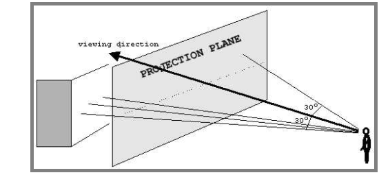
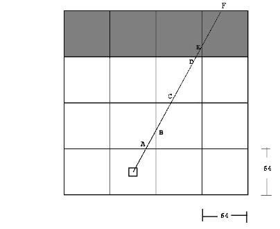
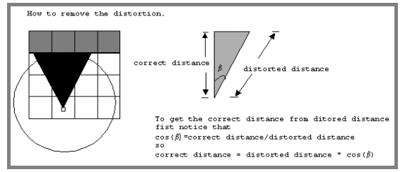

[Back](../../)

&nbsp;

# Ray-Casting
---  

&nbsp;

### 1. Basics    
&nbsp;&nbsp;&nbsp;&nbsp;&nbsp; [<font size="-1">1.1 What is Ray-Casting?</font>](#ch1-1)  
&nbsp;&nbsp;&nbsp;&nbsp;&nbsp; [<font size="-1">1.2 Limitations of Ray-Casting</font>](#ch1-2)  

### 2. The process of Ray-Casting   
&nbsp;&nbsp;&nbsp;&nbsp;&nbsp; [<font size="-1">2.1 Creating a World</font>](#ch2-1)  
&nbsp;&nbsp;&nbsp;&nbsp;&nbsp; [<font size="-1">2.2 Defining project attributes</font>](#ch2-2)  
&nbsp;&nbsp;&nbsp;&nbsp;&nbsp; [<font size="-1">2.3 Finding walls</font>](#ch2-3)  
&nbsp;&nbsp;&nbsp;&nbsp;&nbsp; [<font size="-1">2.4 Finding distance to walls</font>](#ch2-4)  
&nbsp;&nbsp;&nbsp;&nbsp;&nbsp; [<font size="-1">2.5 Drawing walls</font>](#ch2-5)  

&nbsp;

---  

&nbsp;

&rarr; Content originally from [here](https://permadi.com/1996/05/ray-casting-tutorial-table-of-contents/).  
&rarr; C code taken from video series [here](https://www.youtube.com/watch?v=gYRrGTC7GtA&t=3s).

&nbsp;

# Basics  

&nbsp; 

<a name="ch1-1"></a>
## 1.1 What is Ray-Casting?  

Ray-casting sensation began with the release of a game, Wolfenstein 3D (*iD Software*), in 1992. In Wolfenstein 3D, the player is placed on a three dimensional maze-like environment, where he/she must find an exit while battling multiple opponents. Wolfenstein 3D becomes an instant classic for its fast and smooth animation. What enables this kind of animation is an innovative approach to three dimensional rendering known as **“ray-casting.”**

Wolfenstein 3D was developed and created by Id Software. Henceforth, Id’s programmer, *John Carmack*, might well be the person who initiates the ray-casting sensation.

> Ray-casting is a technique that transform a limited form of data (a very simplified map or floor plan) into a 3D projection by tracing rays from the view point into the viewing volume.


> The important point to remember is that ray-casting **“traces rays backward from viewer’s eye to objects.”**

&nbsp;

### Ray-Casting vs Ray-Tracing  

Like ray-casting, ray-tracing “determines the visibility of surfaces by tracing imaginary rays of light from viewer’s eye to the object in the scene”.  

From both definitions, it seems that ray-casting and ray-tracing is the same. Indeed, some books use both terms interchangeably. From game programmers perspective, however, ray-casting is regarded as a special implementation (subclass) of ray-tracing.  

This distinctions because is made because in general, ray-casting is faster than ray-tracing. This is possible because ray-casting utilizes some geometric constraint to speed up the rendering process. For instance: walls are always perpendicular with floors (you can see this in games such as Doom or Wolfenstein 3D). If it were not for such constraints, ray-casting will not be feasible. We would not want to ray-cast arbitrary splines for instance, because it is difficult to find a geometrical constraints on such shapes.  

> The main point to remember is that there are “less number of rays” to trace in ray-casting because of some “geometric constraints.” Or, it can also be said that ray-casting is a special purpose implementation of ray-tracing.

|Ray-Casting|Ray-Tracing|
|:---|:---|
|**Principle**: rays are cast and tracedin groups based on some geometric constraints. For instance: on a 320×200 display resolution, a ray-caster traces only 320 rays (the number 320 comes from the fact that the display has 320 horizontal pixel resolution, hence 320 vertical column).|**Principle:** each ray is tracedseparately, so that every point (usually a pixel) on the display is traced by one ray. For instance: on a 320×200 display resolution, a ray-tracer needs to trace 320×200 (64,000) rays. (That is roughly 200 times slower than ray-casting.)|  
|**Formula:** in most cases, inexact.|**Formula:** in most cases, exact.|  
|**Speed:** very fast compared to ray-tracing; suitable for real time process.|**Speed:** slow; unsuitable for real time process (at least not until we got a 500Ghz machine).|  
|**Quality:** resulting image is not very realistic. Often, they are blocky.|**Quality:** resulting image is very realistic – sometimes too realistic.|  
|**World:** limited by one or more geometric constraints (simple geometric shapes).|**World:** almost any shape can be rendered.|  
|**Storage:** small. Rendered images are not stored on disk. Normally, only the map is stored, and corresponding images are generated “on the fly.”|**Storage:** Rendered images are stored on disk and loaded when needed. Presently, no hardware is fast enough for “on the fly” rendering.|  
|**Examples:** Wolfenstein 3D (iD Software), Shadow Caster (Raven), Arena (Bethesda), Doom (iD Software), Dark Forces (LucasArts).|**Examples:** Examples: 7th Guest (Trilobyte), Critical Path (Mechadeus), 11th Hour (Trilobyte), Myst (Cyan), Cyberia (Xatrix).|  

&nbsp; 

<a name="ch1-2"></a>
## 1.2 Limitations of Ray-Casting  

Ray casting is fast because it utilizes some geometric constraints. In most cases, **walls are always at 90 degrees angle with the floor**. (Note that we are not talking about the angle between walls and another walls, but the angle between walls and floor.)  

Thus, a limitation that almost exists on a ray-casting game is that the viewpoint cannot be rotated along the Z axis (see Figure below). If this is allowed, then walls could be slanted and the benefit of drawing in vertical slices will be lost. This inability to rotate along the Z axis is one of the reason of why ray-casting environment is not regarded as a true three dimensional environment.  

> On a ray-casting environment, the player can move forward, backward, and turn left or right; but cannot rotate/swing around the Z-axis (this kind of Z-axis rotation is called a tilt).


&nbsp;

---

&nbsp;

# The process of ray-casting   

&nbsp; 

<a name="ch2-1"></a>
## 2.1 Creating a World  

To illustrate the process of ray-casting, we will create a maze world that has the following geometric constraints:  

1. Walls are always at 90° angle with the floor.  
2. Walls are made of cubes that have the same size.  
3. Floor is always flat.  

For our purpose, each cube will have the size of 64x64x64 units. (The choice of 64 is arbitrary, but it will be useful to pick a number that is a multiple of 2; because we can perform some arithmetic shift operations on such number (shift operations are faster than multiplication or division). The larger the size of the cube, the blockier the world will look like, but smaller cube will make the rendering slower.)  


Before continuing, we will define our coordinate system so that there is no confusion.

  

Note: Any kind of cartesian coordinate system would work just as well. However, you do have to be consistent (don’t use the top-down coordinate system for one thing but then use the buttom-up coordinate for others).  

&nbsp; 

<a name="ch2-2"></a>
## 2.2 Defining project attributes  

Now that we have the world, we need to define some attributes before we can project and render the world. Specifically, we need to know these attributes:

1. Player/viewer’s height, player’s field of view (FOV), and player’s position.
2. Projection plane’s dimension.
3. Relationship between player and projection plane.

The player should be able to see what is in front of him/her. For this, we will need to define a **field of view (FOV)**. The FOV determines how wide the player sees the world in front of him/her (see Figure below). Most humans have a FOV of 90 degrees or more. However, FOV with this angle does not look good on screen. Therefore, we define the FOV to be 60 degrees through trial and experimentation (on how good it looks on screen). The player’s height is defined to be 32 units because this is a reasonable assumption considering that walls (the cubes) are 64 units high.

  

To put the player inside the world, we need to define the **player’s X coordinate**, the **player’s Y coordinate**, and the **angle that the player is facing to**. These three attributes forms the “point of view” of the player.

Suppose that the player is put somewhere in the middle of grid coordinate (1,2) at a viewing angle of 45 degrees relative to the world, then the player’s *point of view* and FOV will be like in the figure below. (One grid consist is 64 x 64 units. Thus, we can also say that the player is in unit coordinate (96,160)).

  

We need to define a projection plane so that we can project what the player sees into the projection plane. A projection plane of 320 units wide and 200 units high is a good choice, since this is the resolution of most VGA video cards. (Video resolution is usually referred in pixels, so think of 1 pixel as equal to 1 unit.)  

When the player’s *point of view* is projected into the projection plane, the world should look like the scene in figure below.  

  

> By knowing the *field of view* (FOV) and the dimension of the projection plane, we can calculate the angle between subsequent rays and the distance between the player and the projection plane.  

&nbsp;

**Here is what we know:**
  

**Here is what we can calculate** (most of these are high school level math):
  

**So now we know:**

- Dimension of the Projection Plane = 320 x 200 units  
- Center of the Projection Plane = (160,100)  
- Distance to the Projection Plane = 277 units  
- Angle between subsequent rays = 60/320 degrees  

(We will occasionally refer the “angle between subsequent rays” as the “angle between subsequent columns.” Later, this angle will be used to loop from column to column. The distance between player to the projection plane will be used for scaling.)

&nbsp; 

<a name="ch2-3"></a>
## 2.3 Finding walls  

Notice from the previous image, that the wall can be viewed as collection of 320 vertical lines (or 320 wall slices).  

  

This is precisely a form of geometrical constraints that will be suitable for ray-casting. Instead of tracing a ray for every pixel on the screen, we can trace for only every vertical column of screen. The ray on the extreme left of the FOV will be projected onto column 0 of the projection plane, and the right most ray will be projected onto column 319 of the projection plane.  

  

Therefore, to render such scene, we can simply trace 320 rays starting from left to right. This can be done in a loop. The following illustrates these steps:

1. Based on the viewing angle, subtract 30 degrees (half of the FOV).  
2. Starting from column 0:  
    a. Cast a ray. (The term “cast” is a bit confusing. Imagine the player as a wizard who can “cast” rays instead of spells. The ray is just an “imaginary” line extending from the player.)  
    b. Trace the ray until it hits a wall.  
3. Record the distance to the wall (the distance is equal to the length of the ray).  
4. Add the angle increment so that the ray moves to the right (we know from Figure 10 that the value of the angle increment is 60/320 degrees).  
5. Repeat step 2 and 3 for each subsequent column until all 320 rays are cast.  

The trick to **step 2a.** is that instead of checking each pixels, we only have to check each grid. This is because a wall can only appear on a grid boundary. Consider a ray being traced as in figure below. To check whether this ray has hit a wall or not, it is sufficient to check the grid intersection points at A, B, C, D, E, and F.  

This ray intersects the grids at points A,B,C,D,E, and F:
  

To find walls, we need to check any grid intersection points that are encountered by the ray; and see if there is a wall on the grid or not. **The best way is to check for horizontal and vertical intersections separately.** When there is a wall on either a vertical or a horizontal intersection, the checking stops. The distance to both intersection points is then compared, and the closer distance is chosen. This process is illustrated in the following two figures.  

&nbsp;

  

Steps of finding intersections with **horizontal grid lines**:

1. Find coordinate of the first intersection (point A in this example).
2. Find Ya. (Note: Ya is just the height of the grid; however, if the ray is facing up, Ya will be negative, if the ray is facing down, Ya will bepositive.)
3. Find Xa using the equation given above.
4. Check the grid at the intersection point. If there is a wall on the grid, stop and calculate the distance.
5. If there is no wall, extend the to the next intersection point. Notice that the coordinate of the next intersection point -call it (Xnew,Ynew) is *Xnew=Xold+Xa*, and *Ynew=YOld+Ya*.

As an example the following is how you can get the point A:  

```c
Note: remember the Cartesian coordinate is increasing downward, and any fractional 
values will be rounded down.  

======Finding horizontal intersection ======

1. Finding the coordinate of A.  
   If the ray is facing up      
        A.y = rounded_down(Py/64) * (64) - 1;

   If the ray is facing down
        A.y = rounded_down(Py/64) * (64) + 64;

   (In the picture, the ray is facing up, so we use the first formula.  
        A.y=rounded_down(224/64) * (64) - 1 = 191;
   
   Now at this point, we can find out the grid coordinate of y.
   However, we must decide whether A is part of the block above the line, or the 
   block below the line. Here, we chose to make A part of the block above the line, 
   that is why we subtract 1 from A.y.
   So the grid coordinate of A.y is 191/64 = 2;

        A.x = Px + (Py-A.y)/tan(ALPHA);
   In the picture, (assume ALPHA is 60 degrees), 
        A.x=96 + (224-191)/tan(60) = about 115;
   The grid coordinate of A.x is 115/64 = 1;

   So A is at grid (1,2) and we can check whether there is a wall on that grid.
   There is no wall on (1,2) so the ray will be extended to C.

2. Finding Ya
   If the ray is facing up      
        Ya=-64;
   If the ray is facing down
        Ya=64;

3. Finding Xa
        Xa = 64/tan(60) = 36;

4. We can get the coordinate of C as follows:
        C.x=A.x+Xa = 115+36 = 151;
        C.y=A.y+Ya = 191-64 = 127;

   Convert this into grid coordinate by dividing each component with 64.  

   The result is 
        C.x = 151/64 = 2 (grid coordinate), 
        C.y = 127/64 = 1 (grid coordinate) 

   So the grid coordinate of C is (2, 1).(C programmer's note: Remember we always 
   round down, this is especially true since you can use right shift by 8 to divide 
   by 64).

5. Grid (2,1) is checked.  
   Again, there is no wall, so the ray is extended to D.  

6. We can get the coordinate of D as follows:
        D.x=C.x+Xa = 151+36 = 187;
        D.y=C.y+Ya = 127-64 = 63;
   Convert this into grid coordinate by dividing each component with 64.  

   The result is 
        D.x = 187/64 = 2 (grid coordinate), 
        D.y = 63/64 = 0 (grid coordinate) 

   So the grid coordinate of D is (2, 0).  

7. Grid (2,0) is checked.  
   There is a wall there, so the process stop.
```  

Programmer’s note: You can see that once we have the value of Xa and Ya, the process is very simple. We just keep adding the old value with Xa and Ya, and perform shift operation, to find out the grid coordinate of the next point hit by the ray.  

&nbsp;

  

Steps of finding intersections with **vertical grid lines**:

1. Find coordinate of the first intersection (point B in this example).
    The ray is facing right in the picture, so *B.x = rounded_down(Px/64) \* (64) + 64*.
    **If the ray had been facing left B.x = rounded_down(Px/64) \* (64) – 1.**  
        *A.y = Py + (Px-A.x)\*tan(ALPHA)*;
2. Find Xa. (Note: Xa is just the width of the grid; however, if the ray is facing right, Xa will be **positive**, if the ray is facing left, Ya will be **negative**.)
3. Find Ya using the equation given above.
4. Check the grid at the intersection point. If there is a wall on the grid, stop and calculate the distance. 
5. If there is no wall, extend the to the next intersection point. Notice that the coordinate of the next intersection point -call it (Xnew,Ynew) is just *Xnew=Xold+Xa*, and *Ynew=YOld+Ya*.  

In the picture, First, the ray hits point B. Grid (2,2) is checked. There no wall on (2,2) so the ray is extended to E. Grid (3,0) is checked. There is a wall there, so we stop and calculate the distance.

In this example, point D is closer than E. So the wall slice at D (not E) will be drawn.  

&nbsp; 

<a name="ch2-4"></a>
## 2.4 Finding distance to walls  

There are several ways to find the distance from the viewpoint (player) to the wall slice. They are illustrated below.  

  

The sine or cosine functions are cheaper to implement because they can be pre-computed and put into tables. This can be done because ALPHA (player’s POV) has to be between 0 to 360 degrees, so the number of possibilities are limited (the square root method has a virtually unlimited possible values for the x’s and y’s).  

Before drawing the wall, there is one problem that must be taken care of. This problem is known as the “fishbowl effect.” Fishbowl effect happens because ray-casting implementation mixes polar coordinate and Cartesian coordinate together. Therefore, using the above formula on wall slices that are not directly in front of the viewer will gives a longer distance. This is not what we want because it will cause a viewing distortion such as illustrated below.  

  

  

Thus to remove the viewing distortion, the resulting distance obtained from equations must be multiplied by cos(BETA); where BETA is the angle of the ray that is being cast relative to the viewing angle. On the figure above, the viewing angle (ALPHA) is 90 degrees because the player is facing straight upward. Because we have 60 degrees field of view, BETA is 30 degrees for the leftmost ray and it is -30 degrees for the rightmost ray.

&nbsp; 

<a name="ch2-5"></a>
## 2.5 Drawing walls  

